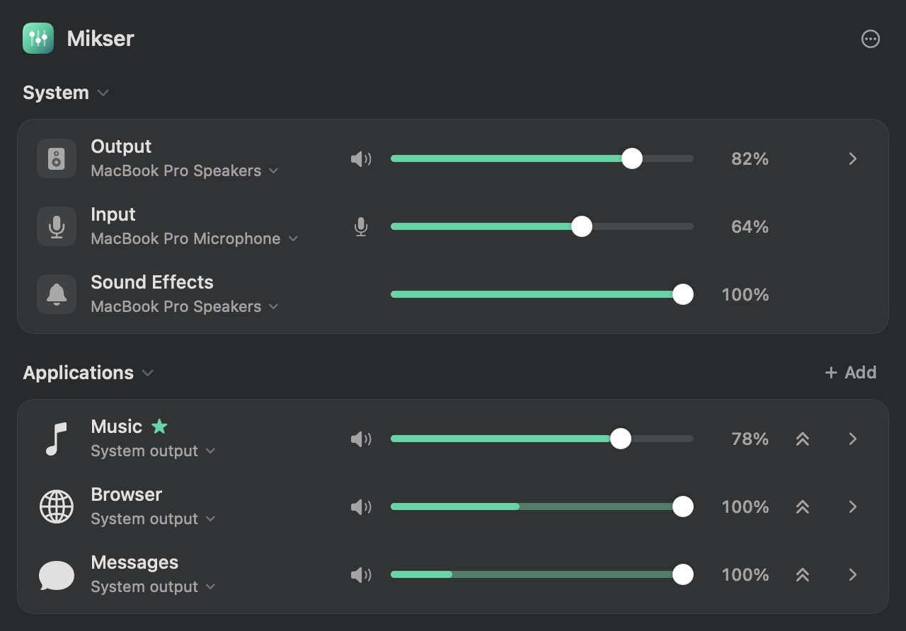

# Mikser

[](https://github.com/erdmncdr/Mikser/actions/workflows/build.yml)

> **Status:** Early development (0.1). The core audio path works, but test on your
> own devices before relying on it for critical audio.

Per-application audio control for macOS. A menu bar panel that sets the volume of
each application separately, mutes it, routes it to a different output device, and
runs it through a ten-band equalizer — built entirely on public Core Audio APIs.
No kernel extension, no code injection, no audio driver to install.

Mikser checks a cryptographically signed GitHub feed once a day. Starting with
version 0.2.0, future releases can be downloaded and installed from the built-in
**Check for Updates…** command. Older builds need to install version 0.2.0 once
manually before they can receive automatic update notifications.



## Why this exists

Until macOS 14.2 there was no supported way to control audio per application. Tools
in this space had to ship their own audio driver and inject code into other
processes, which is why they were hard to build and hard to maintain.

In 14.2 Apple opened the **Core Audio process tap** API, and the whole problem
became solvable with public APIs. Mikser is a demonstration of that: the entire
audio path is a few hundred lines of ordinary Swift.

The chain looks like this:

```
application output
     │
     ▼
process tap  ────────────  CATapDescription(stereoMixdownOfProcesses:)
     │                     muteBehavior = .mutedWhenTapped
     │                     (while we read it, the app's audio never reaches the hardware)
     ▼
private aggregate device ─ [tap input] + [target output device]
     │
     ▼
IOProc (realtime)          gain · balance · equalizer · soft limiting · peak metering
     │
     ▼
  speakers
```

Every controlled application gets its own tap and its own private aggregate device.
That buys two things: applications start and stop independently of each other, and
**per-application output routing** comes almost for free — pointing one application's
aggregate device at different hardware is the whole implementation.

### Untouched applications are never tapped

No tap is created for an application the user has not configured. Its audio goes
straight to the hardware: no added latency, no CPU cost. The tap appears the first
time you change something and stays until you explicitly release the application
(returning the volume to 100% does not tear it down, so the audio never cuts out as
you drag past it).

### Helper process grouping

Chromium- and Electron-based applications often play audio from helper processes
rather than the main one. Mikser groups them by bundle ID into a single row and
covers them all with one tap — `CATapDescription` accepts several processes. When a
new helper appears, the tap is rebuilt automatically.

## Features

- Per-application volume and mute
- Per-application **boost** up to 500%, through a soft limiter that cannot clip
- Per-application **balance**, applied as channel gain inside the IOProc
- Per-application **ten-band equalizer** with eight presets
- Per-application output device routing
- Per-application level meters, built into the volume fader
- Favourites: applications stay in the list while closed, with their settings ready
- Hide applications from the panel without interrupting their saved audio settings
- System output / input / sound effects rows, each with its own device menu
- Sample rate control for the output device
- Collapsible sections and row details, with the state remembered
- A custom menu bar mark with a live four-step level indicator
- Settings persisted per bundle ID, tolerant of missing fields in older records

## Requirements

- macOS 15 or later (process taps arrived in 14.2; `bundleIDs` and
  `processRestoreEnabled` in 26.0)
- A Swift 6 toolchain. Full Xcode is not required — Command Line Tools is enough.

## Build and run

```bash
./build.sh && open build/Mikser.app
```

A slider mark appears in the menu bar; the panel opens from there.

`build.sh` generates the application icon on the first run and signs the bundle
ad-hoc. An ad-hoc signature changes on every build, so macOS may ask for the audio
capture permission again. For a permanent grant, create a self-signed code signing
certificate in Keychain Access and pass its name:

```bash
MIKSER_SIGN_ID="Mikser Dev" ./build.sh
```

Every successful GitHub Actions run also publishes a zipped, ad-hoc-signed
`Mikser.app` bundle as the **Mikser-macOS** workflow artifact.

## Installing a release build

Releases are signed ad-hoc rather than with an Apple Developer ID. macOS
quarantines anything downloaded from the internet, and Gatekeeper refuses to launch
a quarantined app that carries no Developer ID signature, so the first launch fails
with a "Mikser is damaged and can't be opened" alert.

Move the app where you want it, then clear the quarantine attribute once:

```bash
xattr -d com.apple.quarantine /Applications/Mikser.app
```

Alternatively, attempt to open it and then allow it from
**System Settings → Privacy & Security → Open Anyway**.

Building from source avoids this entirely — a locally built bundle is never
quarantined.

## Interface

The panel has two groups, **System** and **Applications**. Every row has the same
shape: icon · name, with the output device beneath it · mute · fader · percentage ·
boost · details. There are no column headers; each control explains itself on hover.

- **The device** is the small line under a row's name. Click it to choose where that
  row's sound goes. Application rows follow the system output until you pick a
  device; a routed row shows its device in the accent colour.
- **The fader is also the level meter.** For an application Mikser is processing, the
  fill up to the knob is dim and lights up as far as the signal reaches, so a playing
  application visibly pulses. Past 100% the fill turns amber.
- **Boost** (the double chevron) lets the fader go to 500%. It turns amber when on,
  matching the boosted part of the fader.
- **Details** (the chevron at the end of the row) opens sample rate on the output row,
  and balance plus the equalizer on application rows.
- **Favourites** keep an application listed while it is silent. The star beside the
  name is shown for favourites and offered on hover for everything else. **Add** in
  the Applications header adds any application, running or not.

The System group holds three rows:

| Row | What it controls |
| --- | --- |
| Output | Hardware volume, mute and device for the default output |
| Input | Level and mute for the default input (`kAudioObjectPropertyScopeInput`) |
| Sound Effects | Alert volume and `kAudioHardwarePropertyDefaultSystemOutputDevice` |

Right-click an application and choose **Hide from List** to remove it from the panel.
Hidden applications come back from the **hidden** menu under the list, or from the
settings menu (•••) in the header.

### Pop-up menus

Every menu in the panel (devices, settings, presets, sample rate) goes through
`PopUpMenu`, which covers its SwiftUI label with a small AppKit view that opens an
`NSMenu` on click. SwiftUI's `Menu` is not used: with `.borderlessButton` it renders
through an `NSPopUpButton` that sizes its hit area to the label's text and image, and
a 34pt device pill turned out to respond only in a 14pt strip through its middle.
`--preview --click-test` clicks every menu control near each edge and in its centre
and fails if any click does not open a menu.

### Metrics

The panel is 640pt wide on the system popover material, rows are 46pt (a two-line
name block plus 2×7pt padding), and names are 13pt. Every measurement lives in
`Layout` and every font in `Typography`; the fader is the only flexible column.

### Menu bar

`MikserIcon` draws the brand mark (a rounded square holding two faders) and the
four-step level indicator beside it into a **single** NSImage, with the five states
prepared up front.

The single image is a requirement rather than a preference: passed as two separate
`Image` views in the `MenuBarExtra` label, the second one never rendered at all.

The image is a template, so macOS tints it for the light or dark menu bar. Template
images use alpha as a mask, which is why lit blocks are drawn at full alpha and unlit
ones at 25% — no separate assets for the two appearances.

The mark is deliberately device independent. It reflected the output device at one
point (an AirPods symbol while AirPods were connected), but macOS already shows that
with its own icon, so it was pure repetition. The mark identifies the application;
the blocks carry the information.

## Architecture

| File | Responsibility |
| --- | --- |
| `Core/CoreAudioSupport.swift` | `AudioObjectID` property read/write and listener helpers |
| `Core/AudioDevices.swift` | Device enumeration, defaults, volume, sample rate |
| `Core/AudioProcessMonitor.swift` | HAL process list → real applications, favourites |
| `Core/AppTap.swift` | Tap, aggregate device and the realtime IOProc |
| `Core/Equalizer.swift` | Ten-band equalizer DSP with lock-free coefficient publishing |
| `Core/SystemAudio.swift` | Alert volume (absent from Core Audio; scripting interface) |
| `Core/MixerEngine.swift` | State, persistence, tap lifecycle |
| `UI/Theme.swift` | Colours, metrics, typography, the fader and shared row components |
| `UI/PopUpMenu.swift` | Full-size click targets that open AppKit menus |
| `UI/MenuBarContentView.swift` | Panel layout and the system rows |
| `UI/AppRowView.swift` | Application row and its detail section |
| `UI/EqualizerView.swift` | Equalizer interface and the vertical fader |
| `UI/MikserIcon.swift` | Menu bar mark and level indicator drawing |
| `UI/PreviewRunner.swift` | Development mode that opens the panel in a window |
| `Tools/GenerateIcon.swift` | Produces the application icon (.iconset) |
| `SelfTest.swift` | End-to-end verification |

### Realtime thread rules

`AppTap.render` runs on a realtime-priority thread. Allocating memory, taking a lock
or calling into Objective-C there causes audible glitches. Everything is exchanged
with the interface through the lock-free atomics in `TapParameters`. Keep that rule
when touching this file.

## Boost

Boost raises one application's ceiling from 100% to 500%. It exists for material
that was simply recorded or mastered too quietly — a lecture recording, a video
call, a badly mixed video — where the system volume is already at maximum and the
audio is still too faint.

Everything passes through the soft limiter in `AppTap.softClip`, which is
continuous and continuous in its first derivative above a 0.7 threshold and
approaches full scale asymptotically. The output therefore **cannot exceed full
scale no matter how much gain is applied**, so boost cannot produce a sudden jump
in level, and it never hard-clips.

That limiter is also why the ceiling is 500% rather than something lower. What the
gain actually buys depends entirely on how loud the source already is:

| Source peak | 200% | 400% | 500% | Distortion at 500% |
| --- | --- | --- | --- | --- |
| 0 dBFS (normal music) | +2.2 dB | +2.8 dB | +2.9 dB | 37% |
| −10 dBFS | +6.0 dB | +11.1 dB | +11.8 dB | 14% |
| −20 dBFS (quiet video) | +6.0 dB | +12.0 dB | +14.0 dB | **0%** |
| −30 dBFS (very quiet) | +6.0 dB | +12.0 dB | +14.0 dB | **0%** |

Two things follow, and they are the whole design:

**On loud material, boost does almost nothing.** The limiter has already pinned the
level, so past roughly 200% the extra gain adds distortion rather than loudness —
0.7 dB more between 200% and 500%, for nearly double the harmonic distortion. If
music sounds distorted with boost on, turn it down; there is no loudness left to
gain up there.

**On quiet material, the full range is clean.** A −20 dBFS source never reaches the
limiter's threshold even at 500%, measuring 0% distortion while delivering +14 dB.
This is the case boost is for, and capping lower would only take usable headroom
away from it while protecting nothing.

### The slider

With boost on the slider spans 0-500%, but not linearly: unity stays at the
midpoint, exactly where it sits with boost off. The lower half is linear from 0 to
100%; the upper half is exponential, so every equal distance travelled is an equal
number of decibels — +2.8 dB per tenth of the track, whether moving from 100% to
138% or from 362% to 500%.

A linear 0-500% slider would squeeze the everyday 0-100% range into the first fifth
of the track and make ordinary adjustments fiddly.

## The equalizer

Ten bands one octave apart (32 Hz – 16 kHz), ±12 dB each, using the peaking biquad
from the RBJ cookbook in Transposed Direct Form II.

Two things caused real bugs here, both commented in the code:

**Coefficients must be computed for the aggregate device's rate, not the rate the tap
advertises.** The two can differ — with AirPods the tap reported 48 kHz while the
IOProc actually ran at 24 kHz. The wrong rate shifts every filter: missing the band
centre turned a requested +12 dB into roughly +4 dB. Only measurement caught it.

**Coefficients cannot be switched abruptly.** Changing a preset upset the filter state
badly enough that the measured peak briefly rose to ten times its steady value, which
is an audible click. The realtime thread now eases coefficients toward their target at
25% per block, completing the transition in about 40 ms.

## Development modes

The binary inside the app bundle can be run directly. Because it carries the bundle's
code signature, audio capture permission is granted to the same identity as the UI.

```bash
# Open the menu bar panel in an ordinary window (layout work, screenshots)
./build/Mikser.app/Contents/MacOS/Mikser --preview

# Render the panel to light.png and dark.png without screen recording permission
./build/Mikser.app/Contents/MacOS/Mikser --preview --snapshot ~/Desktop

# Check that every pop-up menu opens wherever its control is clicked
./build/Mikser.app/Contents/MacOS/Mikser --preview --click-test

# Write the five menu bar level states to PNGs, scaled up
./build/Mikser.app/Contents/MacOS/Mikser --dump-icons ~/Desktop

# Verify the audio chain end to end
./build/Mikser.app/Contents/MacOS/Mikser --selftest [target]
```

The `--preview` window sizes itself exactly the way the menu bar panel does
(`sizingOptions = [.preferredContentSize]`). This matters: give the window a fixed
height and layout bugs that only appear in the popover — such as a `ScrollView`
collapsing to zero height — stay invisible.

### Verification

`--selftest` measures gain and the equalizer rather than just asserting they run. The
equalizer stages need a **steady tone near 500 Hz** as the source; music produces no
meaningful reading.

```bash
python3 -c "
import wave, struct, math
r=48000; w=wave.open('/tmp/tone500.wav','w'); w.setnchannels(2); w.setsampwidth(2); w.setframerate(r)
w.writeframes(b''.join(struct.pack('<hh', v, v) for v in (int(0.1*32767*math.sin(2*math.pi*500*n/r)) for n in range(r*60))))
w.close()"

afplay /tmp/tone500.wav & sleep 2; ./build/Mikser.app/Contents/MacOS/Mikser --selftest "pid:$!"
```

Expected output:

```
Tap format     : 48000 Hz, 2 channels, 32 bit, lpcm
IOProc rate    : 24000 Hz
Gain control    : WORKING (ratio at 50% is 0.50, expected ~0.50)
Equalizer +12dB : ratio 3.98   (theory 10^(12/20)  = 3.981)
Equalizer −12dB : ratio 0.25   (theory 10^(-12/20) = 0.251)
```

## Localization

The interface, code, and documentation are currently English. The UI strings have
not yet been extracted into localization catalogs; contributions adding other
languages are welcome.

## Privacy

Audio is processed in memory and sent directly to the selected output device. Mikser
does not record audio, transmit it, collect analytics, or include any networking
dependency. Application settings remain on the Mac in `UserDefaults`.

Security reports should follow [SECURITY.md](SECURITY.md). Contributions are welcome;
see [CONTRIBUTING.md](CONTRIBUTING.md).

## Not done yet

- A separate "Audio Devices" window with per-device settings
- Keyboard shortcuts
- Additional effects such as timed mute or recording
- Restoring settings when an application relaunches — macOS 26's
  `CATapDescription.processRestoreEnabled` exists for exactly this

## Known issues

- **Do not run alongside another audio router.** If two of them tap the same
  application the chain collides and one of them captures silence. Quit other audio
  routing tools while testing.
- Switching devices on Bluetooth headphones can produce a brief gap while the
  aggregate device is rebuilt.

## License

GNU General Public License v3.0 or later. See [LICENSE](LICENSE).

Mikser is an independent, clean-room implementation built on public Apple APIs. It is
not derived from, affiliated with, or endorsed by any other audio product.
